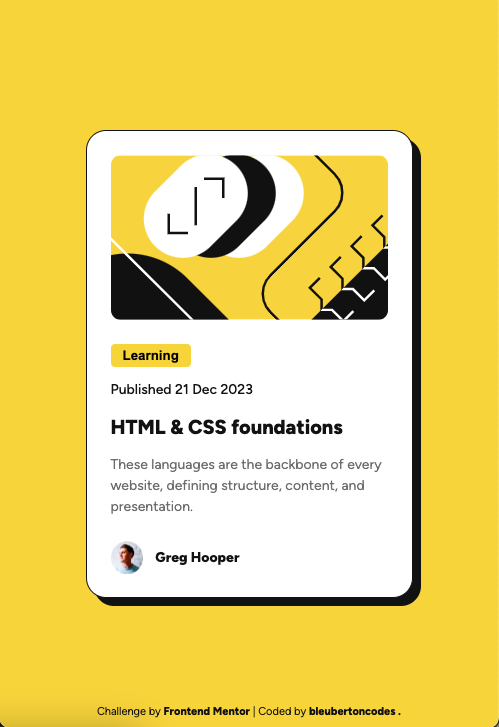
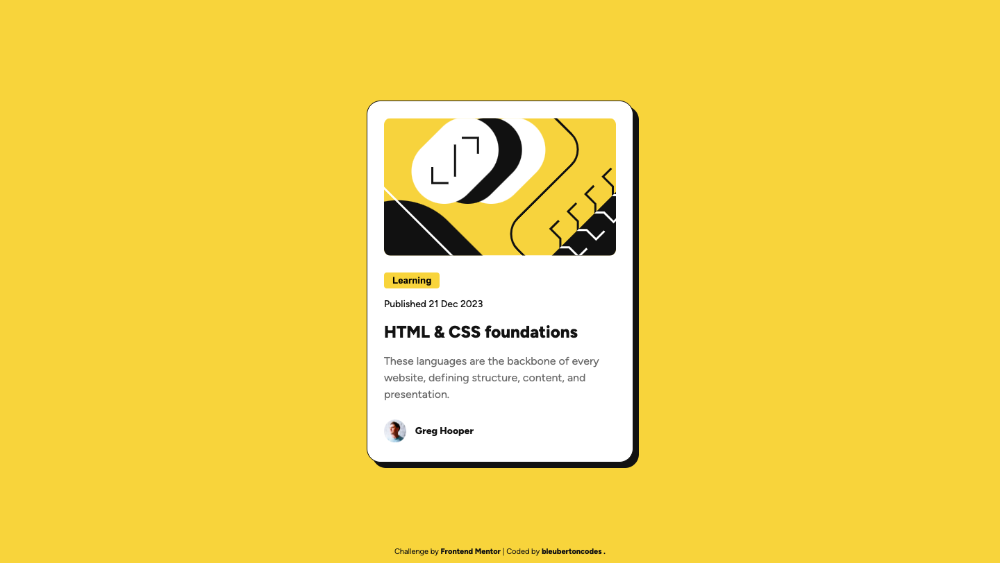

# Frontend Mentor - Blog preview card solution

This is a solution to the [Blog preview card challenge on Frontend Mentor](https://www.frontendmentor.io/challenges/blog-preview-card-ckPaj01IcS). Frontend Mentor challenges help you improve your coding skills by building realistic projects. 

## Table of contents

- [Screenshot](#screenshot)
- [Links](#links)
- [Built with](#built-with)
- [What I learned](#what-i-learned)
- [Continued development](#continued-development)
- [Author](#author)

### Screenshot

### Links

- Solution URL: [Solution](https://github.com/bleubertoncodes/Blog-preview-card-Frontend-Mentor.git)
- Live Site URL: [Live Site](https://bleubertoncodes.github.io/Blog-preview-card-Frontend-Mentor-/)

### Built with

- Semantic HTML5 markup
- CSS custom properties
- Flexbox

### What I learned

I learned about and got more comfortable with using flexbox, margin and positioning to get content where I want it.

### Continued development

This is the second challenge that I have completed without any guidance. Compared to the previous challenge I  completed, I was much more confident in my skills. Withmore practice I will become more efficient as I find my own process.

## Author

- Frontend Mentor - [@bleubertoncodes.](https://www.frontendmentor.io/profile/bleubertoncodes)
- Twitter - [@bleubertoncodes](https://www.twitter.com/bleubertoncodes)
